# Edge detection

<figure markdown>

{ width="300" }
</figure>

Trong giai đoạn đầu của quá trình xử lý ảnh, chúng ta mong muốn đúc kết ra những thông tin về cấu trúc cũng như tính chất của các vật thể trong ảnh. Để làm được điều này, việc tìm ra những đặc trưng cơ bản (feature) của các vật thể này là cần thiết. Cạnh (edge) là một trong những đặc trưng này. <!-- more --> Chúng ta cùng quan sát hai bức ảnh sau:

<figure markdown>

  { width="500" }
  <figcaption markdown>
  Hình 1: Bên trái: Ảnh chụp bức tượng The Archer của Henry Moore (1964). Bên phải: Bản phác thảo của bức tượng này. Ảnh tham khảo từ [[4]](#ref_4).
  </figcaption>
</figure>

Tuy đã giản lược rất nhiều chi tiết và chỉ lưu lại những đường nét nổi bật nhất, bức ảnh bên phải vẫn bảo toàn được một lượng thông tin đủ để giúp ta hình dung được một cách dễ dàng kết cấu và một vài đặc điểm nhất định của vật thể trong bức ảnh gốc. Do vậy, nhận diện cạnh thường là một trong những bước đầu tiên của quá trình khôi phục thông tin từ một bức ảnh. Cũng bởi vai trò quan trọng này nên bài toán nhận diện cạnh vẫn tiếp tục là một lĩnh vực được nghiên cứu được quan tâm rộng rãi. Trong bài viết này, chúng ta sẽ cùng nhau tìm hiểu những khái niệm cơ bản liên quan đến bài toán nhận diện cạnh, các vấn đề thường gặp trong bài toán này cũng như những thuật toán nhận diện cạnh thông dụng.

## 1. Một vài khái niệm

#### 1.1. Ảnh trắng đen (grayscale image)

Bài viết này chỉ sử dụng ảnh grayscale làm minh họa cho bài toán nhận diện cạnh. Ảnh grayscale được sử dụng có giá trị pixel dao động trong khoảng từ 0 đến 255 với 0 là màu đen và 255 là màu trắng, các giá trị ở giữa là những sắc thái xám khác nhau được pha trộn theo một tỉ lệ nhất định hai màu đen và trắng này. Các giá trị của pixel được gọi là mức độ xám (gray level), giá trị này trong một số tài liệu cũng được gọi là cường độ ảnh (image intensity) hay cường độ (intensity).

<figure markdown>

  { width="500" }
  <figcaption markdown>
  Hình 2: Dãy màu cho ảnh grayscale (để ý rằng giá trị của pixel càng thấp có màu ngả sang đen nhiều hơn và ngược lại). Ảnh tham khảo [tại đây](https://cs.calvin.edu/activities/connect/CompRenew/03programming/01programming.html).
  </figcaption>
</figure>

#### 1.2. Cách đánh chỉ số các pixel

Trong mặt phẳng ảnh, ta thường đặt gốc tọa độ ở trung tâm, tia Ox hướng từ trái sang phải và tia Oy hướng từ dưới lên trên. Tuy nhiên khi số hóa thì bức ảnh được biểu diễn bằng một mảng 2 chiều, trong đó mỗi phần tử lưu giá trị của pixel ở vị trí tương ứng. Lưu ý rằng để làm việc với một bức ảnh, ta cần chuyển bức ảnh này thành dạng số, lúc này bức ảnh không còn giữ được tính "liên tục" của nó nữa mà bị "lượng hóa" (quantized) thành các đơn vị nhỏ gọi là các pixel. Thông thường người ta đánh chỉ số các pixel như sau: mỗi pixel có chỉ số $[i,j]$, trong đó $i$ tăng dần từ trái sang phải, $j$ tăng dần từ trên xuống dưới, pixel trên cùng bên trái có chỉ số $[0,0]$.

<figure markdown>

  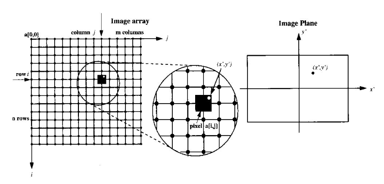{ width="500" }
  <figcaption markdown>
  Hình 3: Một điểm trên mặt phẳng ảnh và pixel tương ứng biểu diễn điểm ảnh ấy (lưu ý rằng nhiều điểm ảnh có thể được biểu diễn bởi một pixel duy nhất). Ảnh tham khảo từ [[1]](#ref_1).
  </figcaption>
</figure>

#### 1.3. Phép tích chập (convolution)

Phép tích chập có quan hệ mật thiết đến phép tương quan chéo (cross correlation). Trong phép tương quan chéo, ta có một hạt nhân (kernel) với một phần tử trung tâm (center) và một mảng đầu vào, lần lượt trượt kernel từ góc trên cùng bên trái của mảng đầu vào theo chiều từ trái sang phải, từ trên xuống dưới. Tại mỗi phần tử của mảng đầu vào mà trung tâm kernel này trượt đến, giá trị của phần tử này được tính bằng cách nhân giá trị mỗi phần tử trong kernel với giá trị phần tử tại vị trí tương ứng của mảng đầu vào, rồi lấy tổng các giá trị này [[3]](#ref_3). Trong phép tích chập, ta cần xoay kernel 180 độ trước khi thực hiện quá trình trên. Bạn đọc có thể tìm hiểu kĩ hơn về khái niệm này qua bài viết [**Mạng nơ-ron tích chập - Convolutional Neural Network (CNN/ConvNet)**](https://ticklab.vn/newest-tutorial/cse/mtcntt-chiasekienthuc/m-ng-no-ron-tich-ch-p-convolutional-neural-network-cnn-convnet), phần 2.1 viết về Lớp tích chập (Convolutional layer).

Ở những phần tiếp theo có sử dụng phép tích chập, ta mặc định rằng các kernel sử dụng đã được xoay 180 độ.

#### 1.4. Cạnh và các nguyên nhân tạo thành cạnh

Cạnh được định nghĩa là sự thay đổi cường độ ảnh một cách đột ngột và đáng kể.

<figure markdown>

  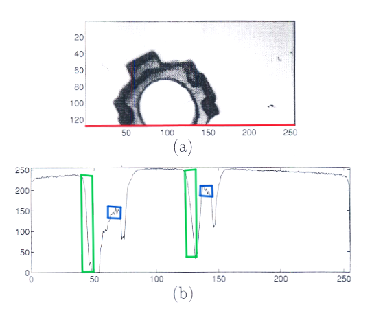{ width="500" }
  <figcaption markdown>
  Hình 4: Hình a: Ảnh của đầu một thanh truyền. Hình b: Đồ thị biểu diễn mức độ xám của mỗi pixel trong dãy pixel nằm trên đường màu đỏ. Ảnh tham khảo từ [[1]](#ref_1).
  </figcaption>
</figure>

Dựa vào đồ thị, ta thấy rằng mức độ xám của pixel trong những _**ô màu xanh lam**_ có sự thay đổi đột ngột nhưng không đáng kể. Chỉ có mức độ xám của các pixel trong các _**ô màu xanh lục**_ là thay đổi vừa đáng kể, vừa đột ngột. Do vậy, chỉ có những sự thay đổi trong các ô màu xanh lục mới được nhận diện là cạnh (lưu ý rằng trong đồ thị có nhiều chỗ biễu diễn cạnh, mình chỉ lấy ví dụ ở hai chỗ), còn sự thay đổi ở những ô màu xanh lam chỉ là nhiễu (noise).

Với định nghĩa này, ta thấy rằng cạnh tạo ra dựa trên sự thay đổi của cường độ ảnh không nhất thiết phải tương ứng với cạnh thực tế của vật thể. Vậy thì các cạnh này thường được tạo thành do đâu?

Bốn nguyên nhân phổ biến tạo nên cạnh là:

*   Sự không liên tục về độ sâu (Depth discontinuity): Giữa hai vật thể (một ở trước và một ở sau) hoặc giữa vật thể và nền khả năng cao sẽ có một sự đứt đoạn, sự đứt đoạn đó hình thành một cạnh.
*   Sự không liên tục về định hướng bề mặt (Surface normal discontinuity): Tuy nằm trên cùng một vật thể và có cùng một chất liệu nhưng sự định hướng khác nhau của các bề mặt dẫn đến ánh sáng mỗi bề mặt nhận được từ nguồn sáng khác nhau nên giữa các bề mặt ấy hình thành cạnh.
*   Sự không liên tục về độ phản xạ của bề mặt (Surface reflectance discontinuity): Nếu một vật thể được làm từ nhiều chất liệu khác nhau thì khả năng cao là ở những chỗ giao nhau giữa các chất liệu ấy sẽ hình thành cạnh do sự phản xạ ánh sáng của mỗi chất liệu là khác nhau.
*   Sự không liên tục về ánh sáng (Illumination discontinuity): Trong nhiều trường hợp, vật thể sẽ ngăn một lượng ánh sáng nhất định, tạo thành bóng. Sự thay đổi đột ngột về mức độ xám của pixel giữa vùng bị hắt bóng và vùng không bị hắt bóng dẫn đến việc tạo thành cạnh giữa hai vùng này.

Hình dưới đây giúp bạn đọc hình dung rõ hơn về các nguyên nhân này:

<figure markdown>

  { width="500" }
  <figcaption markdown>
  Hình 5: Các nguyên nhân tạo thành cạnh (các đường **màu xanh lam** là những cạnh tạo thành do sự không liên tục về định hướng bề mặt, các đường **màu vàng** là những cạnh tạo thành do sự không liên tục về độ phản xạ của bề mặt, các đường **màu xanh lục** là những cạnh tạo thành do sự không liên tục về ánh sáng, các đường **màu đỏ** là những cạnh tạo thành do sự không liên tục về độ sâu). Ảnh tham khảo [tại đây](https://arxiv.org/pdf/2108.00616v1.pdf).
  </figcaption>
</figure>

#### 1.5. Các khái niệm khác:

Ngoài những khái niệm trên thì có một vài khái niệm mà mình cho rằng sẽ cần thiết cho bạn đọc ở những phần sau:

*   Điểm cạnh (edge point): là một điểm trong ảnh có tọa độ $[i,j]$ mà ở đó xảy ra sự thay đổi đột ngột và đáng kể về cường độ ảnh.
*   Đường biên (contour): Một tập các điểm cạnh đã được sắp xếp thứ tự hoặc một đường cong biểu diễn tập các điểm cạnh ấy.
*   Tập các điểm cạnh đã được nhận diện có thể chia làm hai: tập các cạnh đúng (correct edges) và tập các cạnh sai (false edges), tập các cạnh sai này còn được gọi là false positives, nó tương ứng với những điểm không phải là cạnh trong ảnh gốc. Ngoài ra còn một tập cạnh thứ ba, là những cạnh lẽ ra phải được nhận diện là cạnh, nhưng bị bỏ qua bởi thuật toán, tập này được gọi là false negatives.

## 2. Phương pháp đạo hàm cấp một cho bài toán nhận diện cạnh

Ở trên chúng ta đã có định nghĩa về cạnh, là sự thay đổi đột ngột và đáng kể về mức độ xám của các pixel trong ảnh. Sự thay đổi ấy nhắc ta nhớ đến khái niệm gì trong toán học nhỉ? Đúng rồi, là đạo hàm! Chúng ta cùng nhau quan sát bức hình dưới đây:

<figure markdown>

  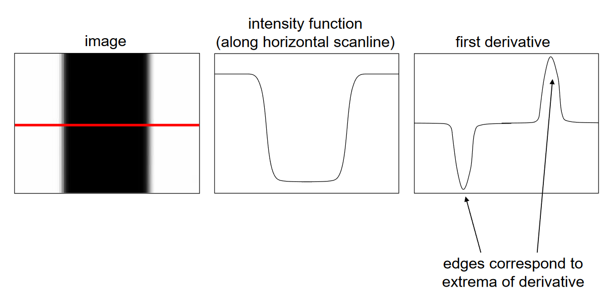{ width="500" }
  <figcaption markdown>
  Hình 6: Hình 1: Dãy các pixel được xét. Hình 2: Đồ thị biểu diễn mức độ xám của mỗi pixel trong dãy. Hình 3: Đạo hàm cấp một của hàm số biểu diễn bởi đồ thị thứ nhất. Ảnh tham khảo [tại đây](http://www.cs.toronto.edu/~fidler/slides/2015/CSC420/lecture3.pdf).
  </figcaption>
</figure>

Trong bức ảnh trên, ta không xét toàn bộ ảnh mà chỉ xét dãy các pixel nằm trên đường kẻ màu đỏ (xem bức ảnh có 1 chiều). Ở đồ thị thứ nhất, ta nhận thấy có hai chỗ mức độ xám thay đổi đột ngột, tương ứng với hai lần các pixel trên đường kẻ màu đỏ chuyển màu từ trắng sang đen và từ đen sang trắng, đó cũng chính là vị trí của hai cạnh. Đồ thị thứ hai biểu diễn đạo hàm cấp một của hàm số biểu diễn bởi đồ thị thứ nhất. Đến đây nếu như bạn thắc mắc rằng: những giá trị của các pixel là rời rạc, thế thì vì sao lại có đạo hàm? Ở đây, chúng ta xem như giá trị của dãy các pixel nằm trên đường màu đỏ được mô tả bởi một hàm số, và bởi vì hàm số này liên tục nên nó có đạo hàm. Trên thực tế, ta không cần phải mô hình hóa giá trị của các pixel bởi một hàm số mà có thể xấp xỉ đạo hàm của chúng một cách rời rạc. Bạn đọc sẽ được tìm hiểu kĩ hơn về cách xấp xỉ đạo hàm ở phần dưới.

Trong không gian 2 chiều thì gradient tại một điểm là một vector

$$
\boldsymbol{G}[f(x,y)] = \begin{bmatrix} G_x \\ G_y \end{bmatrix} = \begin{bmatrix} \frac{\partial f}{\partial x} \\ \frac{\partial f}{\partial y} \end{bmatrix}
$$

Trong đó $f(x,y)$ là hàm số biểu diễn giá trị của pixel tại vị trí $(x,y)$

1.  Hai tính chất quan trọng liên quan đến gradient tại một điểm: Hướng của gradient (gradient direction) là hướng mà mức độ xám pixel tăng nhanh nhất, được cho bởi công thức

    $$
    \alpha(x,y) = \tan^{-1}\left( \frac{G_y}{G_x}\right) 
    $$

2.  Độ lớn của gradient (gradient magnitude), được cho bởi công thức
    
    $$
    G[f(x,y)] = \sqrt{G_x^2 + G_y^2} 
    $$
    
    Độ lớn này được tính theo chuẩn 2 (norm 2). Trên thực tế, để dễ tính toán thì người ta thường ước lượng độ lớn dựa theo chuẩn 1
    
    $$
    G[f(x,y)] = |G_x| + |G_y|
    $$
    
    hoặc chuẩn vô cùng
    
    $$
    G[f(x,y)] = \max\{|G_x|, |G_y|\}
    $$

#### 2.1. Xấp xỉ đạo hàm

Trong ảnh số, do giá trị pixel là rời rạc nên đạo hàm thường được tính bởi sự sai khác giữa giá trị của các pixel gần nhau. Một cách tự nhiên ta nghĩ đến việc xấp xỉ đạo hàm như sau (nhớ rằng hướng tăng của $j$ tương ứng với hướng $Ox$ và hướng tăng của $i$ tương ứng với hướng $-Oy$):

$$
G_x \approx f[i,j+1] - f[i,j]
$$

$$
G_y \approx f[i,j] - f[i+1, j]
$$

Cách xấp xỉ này được biểu diễn bởi 2 kernel tích chập sau

$$
s_x = \begin{bmatrix} -1 & 1\end{bmatrix} \qquad \qquad s_y = \begin{bmatrix} 1 \\ -1\end{bmatrix}
$$

Tuy nhiên một hạn chế của cách làm này đó là việc áp dụng công thức trên cho ta đạo hàm theo phương $Ox$ tại điểm $[i, j+\frac{1}{2}]$ và đạo hàm theo phương $Oy$ tại điểm $[i+\frac{1}{2}, j]$. Để khắc phục tình trạng này, người ta thường sử dụng kernel $2 \times 2$ thay vì kernel $2 \times 1$ hay $1 \times 2$ như trên:

$$
s_x = \begin{bmatrix} -1 & 1 \\ -1 & 1\end{bmatrix} \qquad \qquad s_y = \begin{bmatrix} 1 & 1 \\ -1 & -1\end{bmatrix}
$$

Việc áp dụng 2 kernel trên sẽ giúp ta xấp xỉ được đạo hàm tại điểm $[i+\frac{1}{2}, j + \frac{1}{2}]$, nhưng cách làm này vẫn có hạn chế: vì điểm được tính đạo hàm nằm ở giữa các pixel chứ không thuộc một pixel nào cả (điểm này còn được gọi là interpolation point, hay điểm nội suy). Một hướng tiếp cận mới được đưa ra: dùng kernel $3 \times 3$ (hay các kernel có số pixel ở mỗi chiều là một số lẻ) để xấp xỉ đạo hàm tại pixel trung tâm, đa phần các kernel (hay toán tử) phổ biến ngày nay đều sử dụng hướng tiếp cận này.

#### 2.2. Một số toán tử phổ biến sử dụng đạo hàm cấp một

*   Toán tử Robert
    
    Toán tử Robert cho ta một công thức khá đơn giản để xấp xỉ gradient tại một điểm theo phương $Ox$ và $Oy$:
    
    $$
    G_x = f[i,j] - f[i+1,j+1]
    $$
    
    $$
    G_y = f[i+1,j] - f[i,j+1]
    $$
    
    Hai giá trị $G_x$, $G_y$ này được tính bởi 2 kernel $2 \times 2$ sau
    
    $$
    s_x = \begin{bmatrix} 1 & 0 \\ 0 & -1\end{bmatrix} \qquad \qquad s_y = \begin{bmatrix} 0 & -1 \\ 1 & 0\end{bmatrix}
    $$
    
    Công thức tính đạo hàm của toán tử Robert khá đơn giản, đồng thời giá trị tính được thuộc về một điểm nội suy nằm giữa các pixel nên toán tử Robert hiếm khi được sử dụng trong thực tiễn.
    
*   Toán tử Sobel
    
    Đối với toán tử Sobel, $G_x$, $G_y$ được tính bởi 2 kernel $3 \times 3$ sau
    
    $$
    s_x = \begin{bmatrix} -1 & 0 & 1 \\ -2 & 0 & 2 \\ -1 & 0 & 1\\ \end{bmatrix} \qquad \qquad s_y = \begin{bmatrix} 1 & 2 & 1 \\ 0 & 0 & 0 \\ -1 & -2 & -1\\ \end{bmatrix}
    $$
    
    Ta có nhận xét rằng toán tử Sobel xấp xỉ được đạo hàm tại điểm nằm trong pixel trung tâm như đã nói ở trên, đồng thời toán tử này đặt trọng số cao cho những pixel nằm gần trung tâm hơn nên nó còn có tác dụng khử nhiễu. Vì vậy toán tử Sobel là một trong những toán tử dùng để tính gradient được sử dụng phổ biến nhất.
    
    Kết quả áp dụng toán tử Sobel:

    <figure markdown>

    { width="500" }
        <figcaption markdown>
        Hình 7: Ảnh gốc đã được chuyển sang dạng grayscale.
        </figcaption>
    </figure>
    
    <figure markdown>

    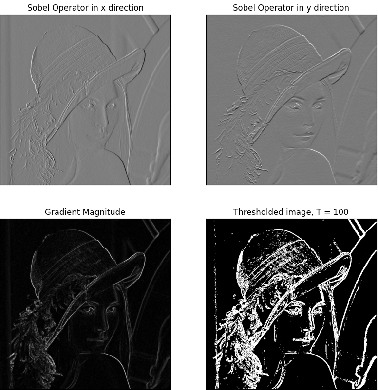{ width="700" }
        <figcaption markdown>
        Hình 8: Hình 1, 2: Kết quả thu được sau khi áp dụng 2 kernel $s_x$, $s_y$ lên ảnh gốc. Hình 3: Kết quả thu được sau khi tính độ lớn gradient tại mỗi pixel trong ảnh. Hình 4: Kết quả thu được sau khi phân ngưỡng hình 3 với ngưỡng T = 100.
        </figcaption>
    </figure>
    
    Lưu ý rằng khi dùng kernel để tính đạo hàm tại mỗi pixel, giá trị thu được có thể là âm hoặc dương, để có thể biểu diễn kết quả này dưới dạng ảnh grayscale (ảnh mà giá trị các pixel nằm trong khoảng từ 0 đến 255), ta dùng một phép ánh xạ chuyển giá trị nhỏ nhất (lúc này là một số âm) thành 0 và giá trị lớn nhất thành 255. Vì vậy ta quan sát thấy bức ảnh thu được đa phần có màu xám vì đa số giá trị đạo hàm nằm ở khoảng giữa hai giá trị này, những đường màu đen là những vị trí mà tại đó giá trị đạo hàm đạt cực tiểu, những đường màu trắng là những vị trí mà tại đó giá trị đạo hàm đạt cực đại.
    
    Bức ảnh thứ ba biểu diễn độ lớn gradient tại mỗi pixel, thu được bằng cách lấy căn của tổng bình phương giá trị pixel tương ứng ở hai bức hình trên (lúc chưa scale). Bức ảnh cuối cùng là kết quả thu được sau khi phân ngưỡng bức ảnh thứ ba, các pixel được nhận diện là cạnh có màu trắng, ngược lại có màu đen (việc phân ngưỡng này sẽ được nói rõ hơn ở mục 3).
    
*   Toán tử Prewitt
    
    Toán tử Prewitt giống với toán tử Sobel, ngoại trừ việc toán tử này không đặt trọng số cao cho những pixel nằm gần trung tâm, tức xem những pixel xung quanh có vai trò ngang bằng nhau trong việc quyết định đạo hàm tại điểm nằm trong pixel trung tâm. 2 kernel $s_x$ và $s_y$ của toán tử này có dạng như sau
    
    $$
    s_x = \begin{bmatrix} -1 & 0 & 1 \\ -1 & 0 & 1 \\ -1 & 0 & 1\\ \end{bmatrix} \qquad \qquad s_y = \begin{bmatrix} 1 & 1 & 1 \\ 0 & 0 & 0 \\ -1 & -1 & -1\\ \end{bmatrix}
    $$
    

#### 2.3. Ảnh hưởng của độ lớn kernel đến khả năng nhận diện cạnh

Một kernel có kích thước nhỏ sẽ xác định được vị trí của cạnh với độ chính xác cao (good localization) nhưng kết quả tính toán được lại rất dễ bị ảnh hưởng bởi nhiễu (noise sensitive): ta chỉ sử dụng 4 hay 9 giá trị của các pixel lân cận để xấp xỉ đạo hàm, nếu như một trong những pixel này chứa nhiễu thì kết quả bị ảnh hưởng rất nhiều. Một kernel lớn sẽ giảm được ảnh hưởng của nhiễu, nhưng độ chính xác khi xác định vị trí của cạnh lại không cao (poor localization): giá trị đạo hàm xấp xỉ cho một pixel bị ảnh hưởng bởi những thông tin ở xa.

## 3. Các bước của một thuật toán nhận diện cạnh

_**Bước 1**_: Filtering (lọc nhiễu)

Việc tính toán đạo hàm đối với các kernel nhỏ ($2 \times 2$, $3 \times 3$) rất dễ bị ảnh hưởng bởi nhiễu bởi nó chỉ dựa trên mức độ xám của 2 hay 3 pixel nằm kề nhau (mình sẽ nói rõ hơn ở phần dưới), chính vì vậy trước khi đi vào thuật toán chính thì lọc nhiễu là một bước không thể thiếu. Tuy nhiên cần lưu ý về mối tương quan giữa mức độ lọc nhiễu và độ sắc của cạnh: càng lọc được nhiều nhiễu thì cạnh sẽ càng mờ.

_**Bước 2**_: Enhancement

Việc nhận diện cạnh không dựa trên giá trị mỗi pixel một cách riêng lẻ mà dựa trên mối tương quan của pixel đang xét với các pixel lân cận. Ở bước này, ta nhấn mạnh sự thay đổi mức độ xám giữa các pixel bằng cách biểu diễn mỗi pixel bằng độ lớn gradient tại điểm đó.

_**Bước 3**_: Detection (nhận diện cạnh)

Sau bước 2, ta thu được một bức ảnh với giá trị mỗi pixel là độ lớn đạo của gradient tại pixel đó. Đây chưa phải là đầu ra mà chúng ta mong muốn. Như đã nói ở trên, những pixel có độ lớn gradient lớn thì mới là cạnh, còn những pixel mà tại đó có sự thay đổi đạo hàm nhưng không đáng kể thì chỉ là nhiễu. Vì vậy ta còn phải thực hiện thêm một bước nữa, đó là phân ngưỡng (thresholding). Sau bước này, ta sẽ thu được một bức ảnh với giá trị mỗi pixel là một giá trị nhị phân (0 nếu pixel không phải là cạnh và 1 nếu pixel là cạnh).

## 4. Phương pháp đạo hàm cấp hai cho bài toán nhận diện cạnh

Ở phương pháp trên, ta tính độ lớn gradient tại mỗi pixel rồi dùng một ngưỡng để xác định một pixel có phải là một cạnh hay không, dẫn đến việc có quá nhiều pixel được nhận diện là cạnh. Để khắc phục hạn chế này, một cách tiếp cận khác là đối với nhiều điểm cạnh nằm kề nhau, ta chỉ nhận những pixel có độ lớn gradient đạt cực đại cục bộ (local maxima). Ta cũng biết rằng, giá trị cực đại của đạo hàm cấp một tương đương với giao điểm của đạo hàm cấp hai và trục hoành, điểm này còn được gọi là điểm về không (zero crossing).

<figure markdown>

{ width="700" }
    <figcaption markdown>
    Hình 9: Đồ thị đầu tiên biểu diễn giá trị mức độ xám của mỗi pixel trong không gian 1 chiều (xem giá trị này là một hàm liên tục), đồ thị thứ hai là đạo hàm cấp một của giá trị này, đồ thị cuối cùng là đạo hàm cấp hai của giá trị này. Ảnh tham khảo [tại đây](http://csundergrad.science.uoit.ca/courses/cv-notes/notebooks/08-edge-detection.pdf).
    </figcaption>
</figure>

Có hai toán tử gắn với đạo hàm cấp hai trong không gian hai chiều: toán tử Laplacian (Laplacian operator) và toán tử đạo hàm cấp hai có hướng (second directional derivative)

#### 4.1. Toán tử Laplacian

Toán tử Laplacian được định nghĩa bằng tổng đạo hàm riêng cấp hai theo phương $Ox$ và $Oy$

$$
\nabla^2f = \frac{\partial^2 f}{\partial x^2} + \frac{\partial^2 f}{\partial y^2}
$$

Trong đó đạo hàm cấp hai của $f$ theo phương $Ox$ được xấp xỉ như sau:

$$
\begin{aligned} \frac{\partial^2 f}{\partial x^2} & = \frac{\partial G_x}{\partial x} \\ & = \frac{\partial f[i,j+1] - \partial f[i,j]}{\partial x} \\ & = \frac{\partial f[i,j+1]}{\partial x} - \frac{\partial f[i,j]}{\partial x} \\ & = (f[i,j+2] - f[i,j+1]) - (f[i,j+1] - f[i,j]) \\ & = f[i,j+2] - 2f[i,j+1] + f[i,j] \\ \end{aligned}
$$

Tuy nhiên công thức trên cho ta xấp xỉ đạo hàm riêng cấp hai theo phương $Ox$ tại pixel có vị trí $[i,j+1]$, để tính đạo hàm này tại vị trí $[i,j]$ ta thay $j$ bởi $j-1$:

$$
\begin{aligned} \frac{\partial^2 f}{\partial x^2} & = f[i,j+1] - 2f[i,j] + f[i,j-1] \end{aligned}
$$

Tương tự, ta có đạo hàm riêng cấp 2 theo phương $Oy$ tại pixel có vị trí $[i,j]$:

$$
\frac{\partial^2 f}{\partial y^2} = f[i+1,j] - 2f[i,j] + f[i-1,j]
$$

Tổng hai giá trị trên cho ta toán tử Laplacian. Ta có kernel tích chập của toán tử này như sau:

$$
\nabla^2 \approx \begin{bmatrix} 0 & 1 & 0 \\ 1 & -4 & 1 \\ 0 & 1 & 0\end{bmatrix}
$$

Sau khi dùng kernel để tính toán giá trị Laplacian của mỗi pixel trong ảnh, toán tử Laplacian sẽ nhận diện một pixel là cạnh nếu qua nó có sự chuyển hóa qua điểm không. Không phải bất kì pixel nào mang giá trị 0 cũng được nhận diện là cạnh, ví dụ những vùng có các pixel đều mang giá trị 0 (trivial zeros) thì không được nhận diện là cạnh.

Từ các công thức trên và kernel tích chập của toán tử Laplacian, ta nhận thấy rằng tuy được định nghĩa dựa trên đạo hàm riêng theo phương $Ox$ và $Oy$, toán tử Laplacian là một đạo hàm vô hướng. Nghĩa là nếu ta tính giá trị Laplacian tại một pixel nhất định, nếu ta xoay bức ảnh 2D xung quanh pixel này theo bất kì chiều nào thì giá trị Laplacian này vẫn không thay đổi (điều này là không đúng đối với đạo hàm cấp hai có hướng mà ta sẽ đề cập đến ở phần tiếp theo).

#### 4.2. Đạo hàm cấp hai có hướng

Đạo hàm cấp hai có hướng là đạo hàm cấp hai được tính theo hướng của gradient. Sử dụng đạo hàm cấp hai có hướng khác với sử dụng Laplacian ở chỗ, nếu như Laplacian nhận một điểm là cạnh nếu như đạo hàm cấp một của nó theo phương $Ox$ và $Oy$ đều đạt cực trị, thì đạo hàm cấp hai có hướng sẽ nhận một điểm là cạnh nếu như nó là điểm về không đối với đạo hàm cấp hai theo hướng vuông góc với hướng của cạnh (hướng gradient).

$$
\frac{\partial^2 f}{\partial n^2} = \frac{f_x^2f_{xx} + 2f_xf_yf_{xy} + f_y^2f_{yy}}{f_x^2 + f_y^2}
$$

Phần chứng minh dưới đây dành cho bạn đọc muốn hiểu thêm về công thức trên, không liên quan đến những phần khác nên hoàn toàn có thể được bỏ qua.

_<u>Chứng minh</u>_

:   Gradient tại điểm $(x,y)$: $\nabla f = (f_x, f_y)$

    Vector đơn vị của vector gradient tại điểm $(x,y)$: $\overrightarrow{n}_0 = \frac{1}{\sqrt{f_x^2 + f_y^2}}(f_x,f_y)$

    Đạo hàm cấp một của hàm $f$ tại điểm $(x,y)$ theo hướng của vector $\overrightarrow{n}$:

    $$
    \frac{\partial f}{\partial n} = \nabla f \cdot \overrightarrow{n}_0 = f_x \cdot \frac{f_x}{\sqrt{f_x^2+f_y^2}} + f_y \cdot \frac{f_y}{\sqrt{f_x^2 + f_y^2}} = \sqrt{f_x^2 + f_y^2}
    $$

    Đạo hàm cấp hai của hàm $f$ tại điểm $(x,y)$ theo hướng của vector $\overrightarrow{n}$:

    $$
    \begin{aligned} \frac{\partial^2 f}{\partial n^2} & = \frac{\partial \left(\sqrt{f_x^2+f_y^2}\right)}{\partial n} \\ & = \frac{f_xf_{xx}+f_yf_{xy}}{\sqrt{f_x^2+f_y^2}} \cdot \frac{f_x}{\sqrt{f_x^2+f_y^2}} + \frac{f_xf_{xy}+f_yf_{yy}}{\sqrt{f_x^2+f_y^2}} \cdot \frac{f_y}{\sqrt{f_x^2+f_y^2}} \\ & = \frac{f_x^2f_{xx} + 2f_xf_yf_{xy} + f_y^2f_{yy}}{f_x^2+f_y^2} \end{aligned}
    $$

Tuy mang lại kết quả tốt trong trường hợp lý tưởng, các toán tử liên quan đến đạo hàm cấp hai lại hiếm khi được sử dụng bởi chúng rất dễ bị ảnh hưởng bởi nhiễu: chỉ một dao động nhỏ của đạo hàm cấp một tạo thành một đỉnh sẽ dẫn đến sự tạo thành một điểm về không của đạo hàm cấp hai. Để giảm sự ảnh hưởng của nhiễu, người ta dùng các bộ lọc nhiễu (filter) mà nổi bật là Gaussian filter. Trong phần tiếp theo, chúng ta sẽ cùng nhau tìm hiểu về hướng tiếp cận kết hợp Gaussian filter và toán tử Laplacian, đồng thời sử dụng định lý đạo hàm của phép tích chập (Derivative Theorem of Convolution) để rút gọn các bước tính toán của thuật toán này.

## 5. Phương pháp tìm cạnh trên ảnh nhiễu

#### 5.1. Ảnh hưởng của nhiễu đến đạo hàm

Để có thể hình dung rõ ràng hơn về tầm ảnh hưởng của nhiễu đến bài toán nhận diện cạnh, chúng ta hãy cùng nhau quan sát bức hình dưới đây. Lưu ý rằng chúng ta đang giả sử bức ảnh ta đang xét là 1D.

<figure markdown>

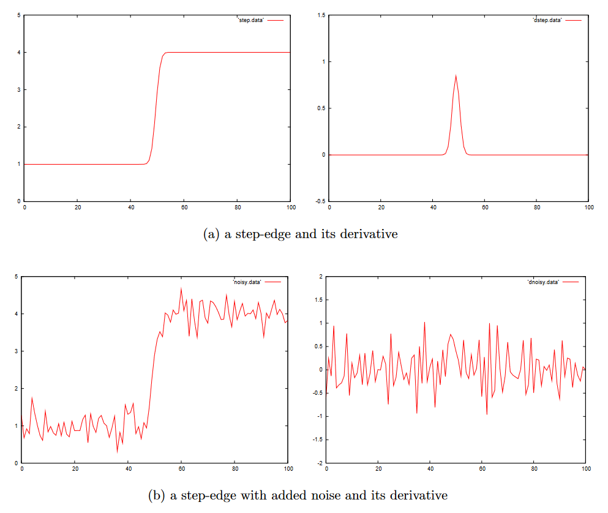{ width="700" }
    <figcaption markdown>
    Hình 10: Hình 1, 2: Đồ thị biểu diễn một cạnh và đạo hàm cấp một của của nó. Hình 3, 4: Đồ thị biểu diễn cạnh tương ứng đã được thêm nhiễu và đạo hàm cấp một của nó. Ảnh tham khảo [tại đây](https://cs.brown.edu/people/pfelzens/engn1610/edge-pics.pdf).
    </figcaption>
</figure>

Ta thấy rằng với sự xuất hiện của nhiễu, ta không thể xác định đâu là vị trí của cạnh dựa trên đồ thị đạo hàm nữa.

Để khắc phục tình trạng này, ta sử dụng Gaussian filter để loại bỏ nhiễu trước khi tính đạo hàm. Kết quả thu được khả quan hơn rất nhiều:

<figure markdown>

{ width="700" }
    <figcaption markdown>
    Hình 11: Đồ thị biểu diễn cạnh sau khi được khử nhiễu bởi Gaussian filter và đạo hàm cấp một của nó. Ảnh tham khảo [tại đây](https://cs.brown.edu/people/pfelzens/engn1610/edge-pics.pdf).
    </figcaption>
</figure>

#### 5.2. Đạo hàm của Gaussian (Derivative of Gaussian)

Một cách tự nhiên, ta rút ra quy trình tìm đạo hàm của bức ảnh như sau: dùng Gaussian kernel để thực hiện phép tích chập lên ảnh đang bị nhiễu, sau đó tính đạo hàm đối với bức ảnh đã được khử nhiễu.

<figure markdown>

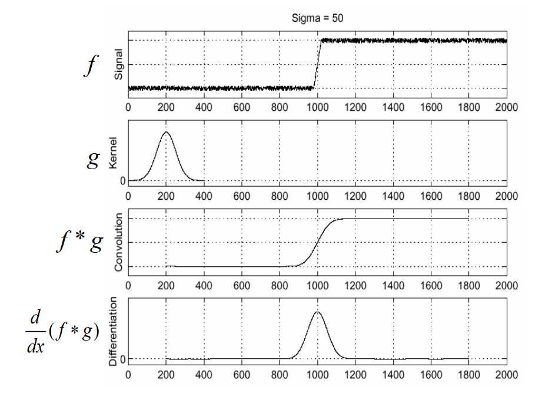{ width="700" }
    <figcaption markdown>
    Hình 12: Các bước của một bài toán nhận diện cạnh đối với ảnh nhiễu (Cách 1: Lấy đạo hàm của ảnh sau khi đã áp dụng Gaussian filter cho ảnh). Ảnh tham khảo [tại đây](http://vision.stanford.edu/teaching/cs131_fall1718/files/05_edges.pdf).
    </figcaption>
</figure>

Tuy nhiên, ta có thể rút gọn quy trình này bằng cách lấy đạo hàm của Gaussian kernel để tạo thành một kernel mới, sau đó dùng phép tích chập đối với kernel này và bức ảnh gốc (có chứa nhiễu). Quy trình này giúp ta tiết kiệm một lượng lớn thời gian vì thông thường kích thước của bức ảnh lớn hơn kích thước của kernel rất nhiều. Một trường hợp mà việc lấy đạo hàm của Gaussian kernel đặc biệt hữu dụng đó là khi ta muốn áp dụng kernel này cho nhiều bức ảnh khác nhau.

<figure markdown>

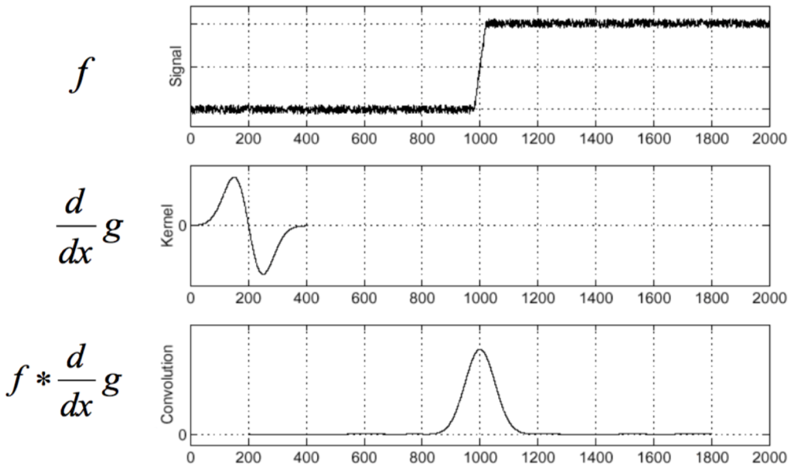{ width="700" }
    <figcaption markdown>
    Hình 13: Các bước của một bài toán nhận diện cạnh đối với ảnh nhiễu (Cách 2: Lấy đạo hàm của Gaussian kernel, sau đó mới áp dụng kernel này cho ảnh). Ảnh tham khảo [tại đây](http://vision.stanford.edu/teaching/cs131_fall1718/files/05_edges.pdf).
    </figcaption>
</figure>

Việc rút gọn này dựa trên tính tuyến tính của phép tích chập (chúng ta sẽ không đi sâu vào chứng minh công thức này), cụ thể:

$$
\frac{d}{dx}(g*f) = \left(\frac{d}{dx}g\right)*f
$$

#### 5.3. Laplacian của Gaussian (Laplacian of Gaussian - LoG)

Tương tự như khi lấy đạo hàm cấp một, ta cũng có thể dùng bộ lọc Gaussian để khử nhiễu trước khi áp dụng toán tử Laplacian lên ảnh, quy trình này cũng có thể rút gọn thành hai bước như trên:

1.  Áp dụng toán tử Laplacian lên Gaussian kernel để tạo thành kernel mới, kernel này còn được gọi là Laplacian của Gaussian (Laplacian of Gaussian hay LoG)
2.  Thực hiện phép tích chập đối với kernel mới tạo thành và ảnh gốc (chưa khử nhiễu)

Việc rút gọn này cũng dựa trên một tính chất của phép tích chập:

$$
\nabla^2(g*f) = \nabla^2g*f
$$

:   Trong đó $ g $ là một hàm Gaussian hai biến số

    $$
    g(x,y) = \frac{1}{{2\pi}\sigma^2}e^{-\frac{x^2+y^2}{2\sigma^2}}
    $$

Suy ra

$$
\begin{aligned} \nabla^2g(x,y) & = \frac{1}{2 \pi \sigma^2}(\frac{x^2}{\sigma^4} - \frac{1}{\sigma^2})e^{-\frac{x^2+y^2}{2 \sigma^2}} + \frac{1}{2 \pi \sigma^2}(\frac{y^2}{\sigma^4} - \frac{1}{\sigma^2})e^{-\frac{x^2+y^2}{2 \sigma^2}} \\ & = -\frac{1}{\pi \sigma^4}\left( 1 -\frac{x^2 + y^2}{2 \sigma^2}\right)e^{-\frac{x^2+y^2}1{2\sigma^2}}\end{aligned}
$$

Thuật toán trên được gọi là Laplacian of Gausian (LoG) hay Marr-Hildreth detector (thuật toán được đề xuất bởi D. Marr và E. Hildreth vào năm 1980). Toán tử LoG còn được gọi là toán tử Mexican Hat vì hình dạng đặc biệt của nó:

<figure markdown>

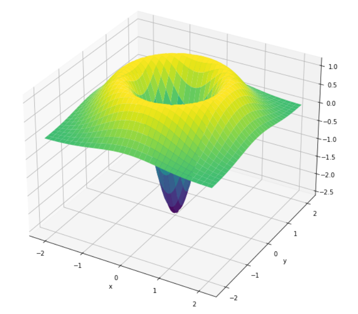{ width="500" }
    <figcaption markdown>
    Hình 14: Hình dạng của Gaussian kernel sau khi được áp dụng toán tử Laplacian giống như một chiếc mũ. Ảnh tham khảo [tại đây](https://hannibunny.github.io/orbook/preprocessing/04gaussianDerivatives.html).
    </figcaption>
</figure>

## 6. Canny Edge Detector

Được phát triển bởi John F. Canny vào năm 1986, thuật toán Canny Edge Detection cho đến nay vẫn là một trong những thuật toán nhận diện cạnh được sử dụng phổ biến nhất vì tính hiệu quả của nó.

Trước khi đi vào thuật toán cụ thể, chúng ta cùng nhau tìm hiểu một vài khái niệm nhé!

#### 6.1. Non-maxima suppression

Như chúng ta đã biết, việc sử dụng đạo hàm cấp một cho bài toán nhận diện cạnh đòi hỏi ta phải xác định một ngưỡng nhất định để nhận diện một pixel với độ lớn gradient bất kì có là cạnh hay không. Đây là công việc khá đau đầu bởi nếu chọn một ngưỡng thấp, sẽ có rất nhiều pixel được nhận diện là cạnh, đặc biệt ở những nơi mà sự thay đổi đạo hàm diễn ra một cách từ từ do cạnh đã bị làm mờ khi lọc nhiễu hoặc do hạn chế nhất định của các loại máy ảnh. Nhưng nếu chọn một ngưỡng cao, ta sẽ bị mất rất nhiều pixel lẽ ra phải được dự đoán là cạnh. Bạn đọc có thể tham khảo bức hình bên dưới.

<figure markdown>

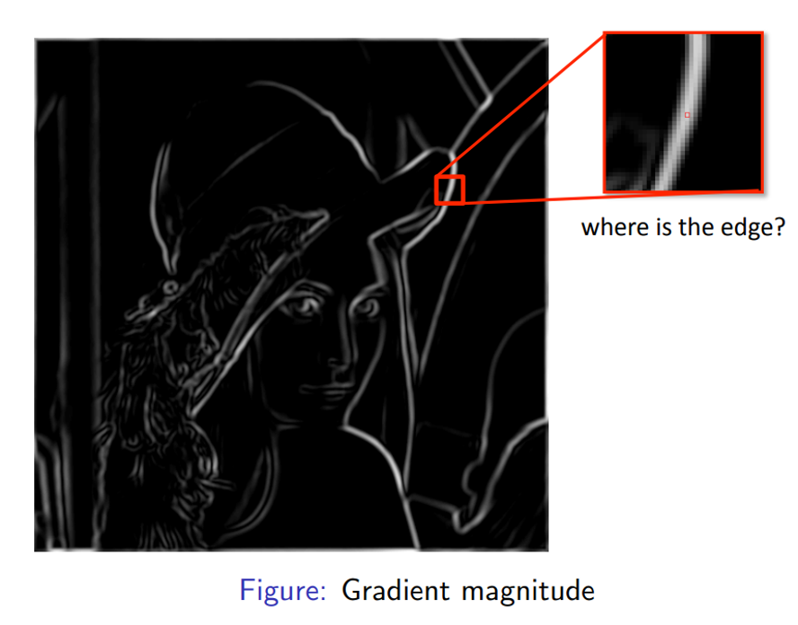{ width="500" }
    <figcaption markdown>
    Hình 15: Ảnh thu được sau khi tính toán độ lớn gradient của từng pixel trong ảnh gốc. Ảnh tham khảo [tại đây](https://cs.brown.edu/people/pfelzens/engn1610/edge-pics.pdf).
    </figcaption>
</figure>

Trong bài toán nhận diện cạnh thì việc xác định chính xác vị trí của cạnh là cần thiết. Trong bức ảnh trên, chúng ta không biết phải chọn ngưỡng như thế nào để vừa có thể thu hẹp được độ rộng của cạnh, vừa tránh không để bị mất cạnh ở những nơi khác.

Ở trên chúng ta đã tìm hiểu một toán tử giúp nhận diện cạnh chỉ tại những vị trí mà độ lớn gradient đạt cực đại, đó là toán tử Laplacian, tuy nhiên toán tử này rất dễ bị ảnh hưởng bởi nhiễu: chỉ một dao động nhỏ trong đạo hàm cấp một cũng tạo thành điểm về không trong đạo hàm cấp hai. Một kĩ thuật khác cũng giúp ta giải quyết được vấn đề này đó là Non-maxima suppression. Non-maxima suppression tận dụng thêm một thông tin nữa: hướng của gradient (ở phần trên, ta biết rằng tại mỗi pixel ta đều tính được độ lớn và hướng của gradient). Từ đó kết quả thu được từ non-maxima suppression ít nhiễu hơn kết quả từ Laplacian bởi nó không lấy cực đại của độ lớn gradient theo mọi hướng mà chỉ theo một hướng nhất định, hay nói cách khác, thuật toán này không lấy các điểm về không theo mọi hướng mà chỉ theo một hướng duy nhất đối với mỗi pixel: hướng của gradient, hay hướng vuông góc với hướng của "cạnh" đang xét.

Hình dưới đây giúp ta hình dung rõ hơn về thuật toán này:

<figure markdown>

{ width="700" }
    <figcaption markdown>
    Hình 16: Ví dụ về thuật toán non-maxima suppression. Pixel ở vị trí chấm xanh trong hình thứ nhất được giữ lại để xét cạnh, pixel tương ứng trong hình thứ hai thì không. Ảnh tham khảo [tại đây](http://csundergrad.science.uoit.ca/courses/cv-notes/notebooks/08-edge-detection.pdf).
    </figcaption>
</figure>

Ở trường hợp đầu tiên, pixel ta đang xét có giá trị độ lớn gradient đạt cực đại theo hướng gradient của pixel này (ta có thể biết giá trị này có đạt cực đại hay không bằng cách so sánh pixel này với hai pixel lân cận theo hướng tương ứng). Vì thế, ta giữ lại pixel này, để ý rằng giá trị tại pixel này không đổi trước và sau nonmaxima suppression. Ở trường hợp thứ hai, do pixel này có giá trị độ lớn gradient nhỏ hơn pixel bên phải của nó theo hướng gradient, nên ta không giữ lại pixel này cho bước tiếp theo. Sau non-maxima suppression, giá trị của pixel này được đặt về 0. Lưu ý rằng thuật toán non-maxima suppression chỉ cho đầu ra là liệu một pixel có được tiếp tục giữ lại để xét là cạnh hay không, nó không đảm bảo các pixel được giữ lại thì chắc chắn là cạnh.

<figure markdown>

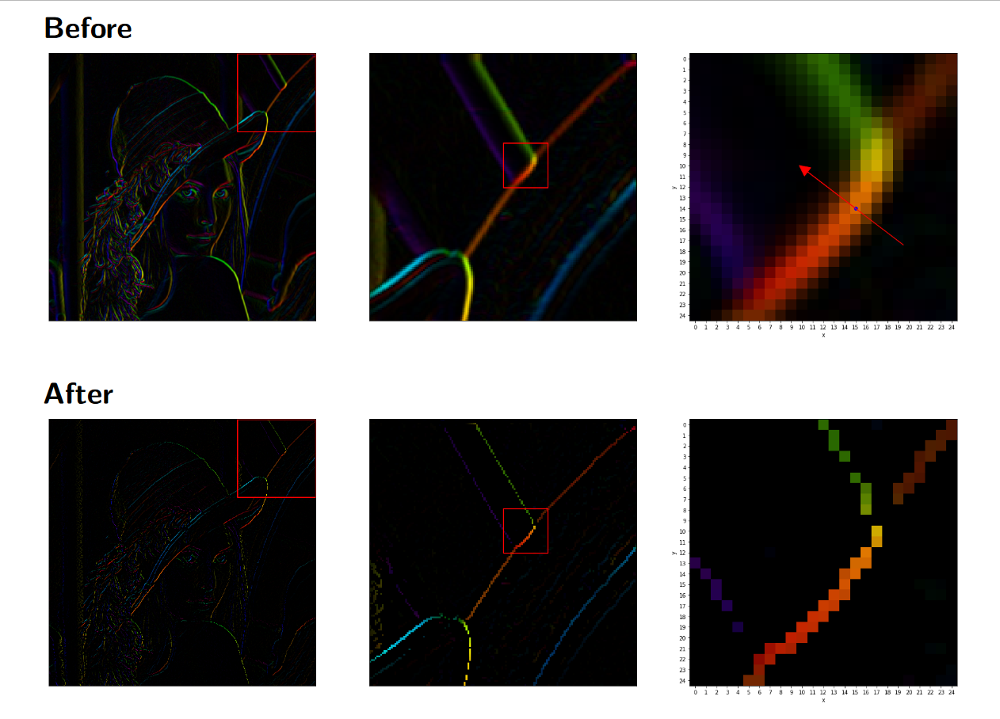{ width="700" }
    <figcaption markdown>
    Hình 17: Ảnh thu được trước và sau non-maxima suppression. Ảnh tham khảo [tại đây](http://csundergrad.science.uoit.ca/courses/cv-notes/notebooks/08-edge-detection.pdf).
    </figcaption>
</figure>

#### 6.2. Hysteresis thresholding

Quay lại vấn đề chọn ngưỡng: việc chọn một ngưỡng cao hay thấp luôn là một sự đánh đổi giữa số lượng cạnh là false positives và false negatives mà ta sẽ thu được. Thuật toán hysteresis thresholding được đưa ra nhằm giúp ta giải quyết vấn đề này.

Ý tưởng của hysteresis thresholding là ta sẽ chọn 2 ngưỡng thay vì 1 ngưỡng: các pixel có giá trị nằm trên ngưỡng cao thì chắc chắn là cạnh (sure-edge pixel), các pixel có giá trị nằm dưới ngưỡng thấp thì chắc chắn không là cạnh. Sau đó ta bắt đầu xét các pixel nằm giữa hai ngưỡng này, những pixel nào là lân cận của các "sure-edge pixel" sẽ được nhận diện là cạnh, điều ngược lại đối với những pixel không là lân cận của "sure-edge pixel" nào cả.

<figure markdown>

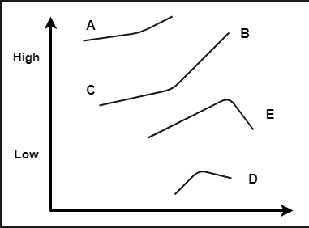{ width="500" }
    <figcaption markdown>
    Hình 18: Ví dụ về thuật toán hysteresis thresholding. Ảnh tham khảo [tại đây](https://theailearner.com/tag/hysteresis-thresholding/).
    </figcaption>
</figure>

Quan sát hình trên, ta thấy rằng A và B chắc chắn là cạnh vì giá trị của chúng cao hơn ngưỡng trên, D chắc chắn không là cạnh vì giá trị của nó thấp hơn ngưỡng dưới, C và E có giá trị nằm giữa hai ngưỡng, tuy nhiên C là cạnh do nó là lân cận của B, còn E thì không.

Chúng ta cùng so sánh thuật toán hysteresis thresholding với cách chọn ngưỡng thông thường:

<figure markdown>

{ width="700" }
    <figcaption markdown>
    Hình 19: Hình 1: Kết quả thu được khi áp dụng hysteresis thresholding. Hình 2: Kết quả thu được khi chỉ dùng một ngưỡng cao. Hình 3: Kết quả thu được khi chỉ dùng một ngưỡng thấp.
    </figcaption>
</figure>

Ta thấy rằng thuật toán hysteresis thresholding vừa đảm bảo không bị nhận diện thiếu quá nhiều cạnh như trong hình thứ hai, vừa giảm thiểu nhiễu như trong hình thứ ba.

#### 6.3. Thuật toán Canny Edge Detection

📐 _**<u>Thuật toán:</u>**_

:   1.  Dùng bộ lọc Gaussian để lọc nhiễu
    2.  Xấp xỉ độ lớn gradient và hướng của gradient cho từng pixel trong ảnh
    3.  Dùng non-maxima suppresion để "làm mỏng" cạnh, tức loại bỏ các pixel không cần thiết
    4.  Dùng hysteresis thresholding để nhận diện cạnh

<figure markdown>

{ width="700" }
    <figcaption markdown>
    Hình 20: Kết quả thu được của thuật toán Canny Edge Detection đối với các cách chọn ngưỡng khác nhau. Hình 1: Kết quả thu được sau khi tính toán độ lớn gradient (ảnh được sử dụng để phân ngưỡng). Hình 2, 3, 4: Kết quả thu được sau khi áp dụng hysteresis thresholding với các ngưỡng $T_1$, $T_2$ khác nhau.
    </figcaption>
</figure>

Một số lưu ý:

*   Để có thể tiến hành bước 4: dùng một ngưỡng để quyết định xem một pixel bất kì có là cạnh hay không, ta cần giữ lại giá trị độ lớn gradient của mỗi pixel ở bước 3.
*   Đến đây nếu bạn đọc thắc mắc rằng vì sao lại cần bước thresholding ở cuối khi bức ảnh thu được sau khi dùng non-maxima suppression đã cho ra hình dáng cạnh như ta mong muốn, bạn có thể xem lại phần 2 mục 3, không những thế, kĩ thuật đặc biệt của hysteresis thresholding còn góp phần giảm đi một lượng nhiễu đáng kể (do nhiễu thường rời rạc, không "kết nối" với nhau).
*   Ở thuật toán non-maxima suppression, thay vì so sánh giá trị độ lớn gradient một pixel với hai pixel lân cận để giữ lại pixel có giá trị cực đại, ta cũng có thể dùng toán tử Laplacian nhưng theo một chiều (chiều của gradient) hoặc đạo hàm cấp hai có hướng và giữ lại pixel ở vị trí về không.

## 7. Kết luận

Ở phần trên, chúng ta có đề cập đến một khái niệm không dùng nhiều trong bài viết này, đó là contour. Đầu ra của bài toán nhận diện cạnh chỉ là các điểm cạnh rời rạc, mặc dù nhìn bằng mắt thường, ta có cảm giác như đó đã là các đường biên, vì mắt ta có khả năng tự "kết nối" các điểm rời rạc này với nhau. Nếu muốn thu được đường biên liên tục của vật thể, hoặc đánh thứ tự các điểm cạnh này để có thể nối chúng lại với nhau tạo thành một đường liền mạch, ta sẽ đến với một bài toán mới, đó là bài toán nhận diện đường biên (Boundary detection).

Qua bài viết này, bạn đọc đã có một cái nhìn toàn cảnh về bài toán nhận diện cạnh, các khái niệm liên quan đến bài toán, các vấn đề thường gặp đối với bài toán này cũng như các thuật toán thông dụng được đề xuất. Việc cố gắng bao trùm về bề rộng chắc chắn sẽ khiến bài viết không đạt được tiêu chí về bề sâu, đồng thời một vài khái niệm cũng được đơn giản hóa, nhưng qua đó mình mong rằng bài viết sẽ cung cấp cho bạn đọc một hình dung nhất định về bài toán này, đồng thời khơi gợi sự tò mò, hứng thú của bạn đọc, để từ đó việc đào sâu vào các chủ đề nâng cao và thú vị khác cũng trở nên dễ dàng hơn (một số chủ đề cũng thú vị không kém trong bài toán nhận diện cạnh mà bạn đọc có thể tiếp tục tìm hiểu như: sự kết hợp giữa Fourier Transform và High-pass filter trong bài toán nhận diện cạnh, hay kĩ thuật Image approximation để xác định vị trí cạnh ở mức độ subpixel,...)

## 8. Tham khảo

1.  Jain, R., Kasturi, R., & Schunck, B. G. (1995). _Machine vision_ (Vol. 5, pp. 309-364). New York: McGraw-hill.
2.  _First Principles of Computer Vision_. (n.d.). [https://fpcv.cs.columbia.edu/](https://fpcv.cs.columbia.edu/)

3.  _6.2. Phép Tích chập cho Ảnh — Đắm mình vào Học Sâu 0.14.4 documentation_. (n.d.). [https://d2l.aivivn.com/chapter\_convolutional-neural-networks/conv-layer\_vn.html](https://d2l.aivivn.com/chapter_convolutional-neural-networks/conv-layer_vn.html)

4.  Nalwa, V. S. (1994). _A guided tour of computer vision_. Addison-Wesley Longman Publishing Co., Inc.
5.  _OpenCV: Canny Edge Detection_. (n.d.). [https://docs.opencv.org/3.4/da/d22/tutorial\_py\_canny.html](https://docs.opencv.org/3.4/da/d22/tutorial_py_canny.html)