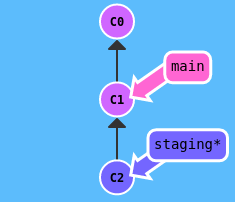

# Git-branch workflow

## Introduction
This training is based on the git-branch workflow that the TickFlow team worked on and other references on the internet.

## The main branches
A repository must have at least these two main branches:
<div class="annotate" markdown>

1. **main**: where the source code is stable and has been released to production.
2. **staging**: where the source code is latest, ready to be merged into the **main** branch for the next release.

</div>

**<u>Note</u>**: All branches above are protected to prevent direct commit.

Follow these steps:
<div class="annotate" markdown>

1. Clone a repository on github, example: [https://github.com/ngyngcphu/mkdocs-tool](https://github.com/ngyngcphu/mkdocs-tool)
2. Connect repository from local to remote:
    ```
    git remote add origin <remote_url>
    ```
3. Push branch **main** up to remote:
    ```
    git push origin main
    ```
4. Create branch **staging** from **main**:
    ```
    git checkout -b staging main
    ```
5. Push branch **develop** up to remote:
    ```
    git push origin staging
    ```
6. Set protection rules for 2 branches: **main** and **staging** at `Settings->Branches->Add branch protection rule`.

</div>

<figure markdown>

  { width="300" }
  <figcaption>Branch main and branch staging</figcaption>
</figure>

## The supporting branches
Besides the main branches, there will be support branches so that team members can work in parallel, easily track features, prepare for release or quickly fix production and staging issues. These support branches will be **deleted** after using, including:
<div class="annotate" markdown>

1. Feature branches
2. Hotfix branches
3. Bugfix branches
4. Test branches
5. Release branches (Optional)

</div>

Using the **release branches** may not be necessary. Instead, the TickFlow team used a tool that automatically generates releases based on conventional commits, that is [release-please-action](https://github.com/google-github-actions/release-please-action).

### Conventional Commit Messages

#### Summary
The commit message should be structured as follows:
```
<type>[optional scope]: <description>
```
The following structural elements:
<div class="annotate" markdown>

1. **fix**: a commit of the type `fix` patches a bug in your codebase.
2. **feat**: a commit of the type `feat` introduces a new feature to the codebase
3. _types_ other than `fix:` and `feat:` are allowed, recommends `build:`, `chore:`, `ci:`, `docs:`, `style:`, `refactor:`, `perf:`, `test:`, and others (based on the [Angular convention](https://github.com/angular/angular/blob/22b96b9/CONTRIBUTING.md#-commit-message-guidelines)).

</div>

A scope may be provided to a commit’s type, to provide additional contextual information and is contained within parenthesis, e.g., `feat(parser): add ability to parse arrays`. For more detailed information, refer to [Convention Commits](https://www.conventionalcommits.org/en/v1.0.0/).

#### Commitlint tool
Tool checks if your commit messages meet the conventional commit format, helps your team adhere to a commit convention.

Follow these steps:
<div class="annotate" markdown>

1. Install:
    ```
    yarn add -D @commitlint/{config-conventional,cli}
    ```
2. Configure:
    ```
    echo "module.exports = {extends: ['@commitlint/config-conventional']}" > commitlint.config.js
    ```
3. To lint commits before they are created you can use Husky's `commit-msg` hook:
    ```
    yarn add -D husky
    yarn husky install
    ```
4. Add hook:
    ```
    yarn husky add .husky/commit-msg  'npx --no -- commitlint --edit ${1}'
    ```
5. Test the hook:
    
6. Add script in `package.json` to automatically enable git hook after installing packages by `yarn`:
    ```
    "script": {
        "prepare": "husky install"
    },
    ```
</div>


### Feature branches
- Branch off from: **staging**
- Merge back into: **staging**
- Branch naming convention: **feature/****

Feature branches are used to develop new features for the upcoming releases. Each feature will be a separate branch, created from the latest source code of **staging**, example: **feature/project**, **feature/member**,... After completing the features, features branch will be merged into **staging** and deleted.

Follow these steps:
<div class="annotate" markdown>

1. Create a feature branch, ex: **feature/part_1** from **staging**:
    ```
    git checkout -b feature/part_1 staging
    ```
2. Make some changes to **feature/part_1**.
3. Commit and push **feature/part_1** up to remote:
    ```
    git push origin feature/part_1
    ```

</div>

After completing all the code in **feature/part_1**, make a **Pull requests** to **staging**. Then, add reviewers.

**<u>Note</u>**: All conversations on code must be resolved before a pull request can be merged into a branch.

After pull request has been merged into **staging** branch on remote. At local, checkout **staging**, delete **feature/part_1** and pull latest code from remote.
```
git checkout staging
git branch -D feature/part_1
git pull origin staging
```

**<u>Note</u>**: 
<div class="annotate" markdown>

1. A pull request must not exceed **20 files changed**. If the feature is too big (> 20 files changed), it should be split into sub-branches, like that: **sub-feature-part_1/search-project**,...Then, make a pull request from **sub-feature-part_1/search-project** to **feature/part_1**, same as above.
2. If there is a pull request that has been merged into `staging`, team members should pull latest code from `staging` to avoid unnecessary conflicts.

</div>

### Hotfix and bugfix branches

#### Hotfix
- Branch off from: **main**
- Merge back into: **main** and **staging**
- Branch naming convention: **hotfix/****

#### Bugfix
- Branch off from: **staging**
- Merge back into: **staging**
- Branch naming convention: **bugfix/****
  
Hotfix and bugfix branches are utilized to address issues that arise in a system. When a problem occurs, we gather information about how it happened (reproduction case) and promptly take corrective action to restore the system's functionality. This quick fix is applied in the hotfix branch. Following this, we investigate the underlying cause of the problem and take more comprehensive measures to prevent similar issues from occurring in the future. These longer-term solutions are implemented in the bugfix branch.

### Test branches
- Branch off from: **any branch**
- Merge back into: **none**
- Branch naming convention: **test/****
  
If you come up with an idea, like a new method for coding or want to add a new tool to the project, you can try it out in a test branch. This lets you test the idea with safety and separation, reducing the potential impact on the main project.

### Release

#### Github Action Workflows
A workflow is a configurable automated process that will run one or more jobs. Workflows are defined by a YAML file in the `.github/workflows` directory of your repository, can be triggered by events like `push`, `pull-requests` or on a `schedule`.

Release workflow is defined in file `release.yml`.

#### Release-please-action tool
A tool auto-release with Conventional Commit Message. 

Set up this action in `.github/workflows/release.yml`:
```yml
release:
    runs-on: ubuntu-latest
    outputs:
      build: ${{ steps.release.outputs.release_created }}
      tag_name: ${{ steps.release.outputs.tag_name }}
    steps:
      - uses: google-github-actions/release-please-action@v3
        id: release
        with:
          release-type: node
          pull-request-header: 'Bot (:robot:) requested to create a new release on ${{ github.ref_name }}'
```
Also, let's create a `build` job to build a package on github container registry (ghcr). This package is a docker image used to run docker-compose.

**<u>Note</u>**: The release pull request generated by the github-action bot is not allowed to merged into `main` until the product is fully featured.