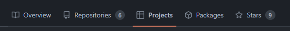
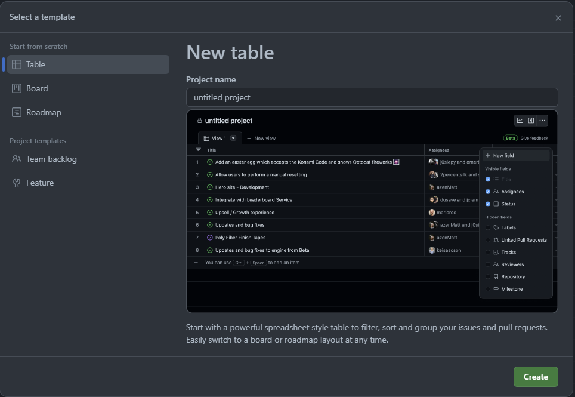
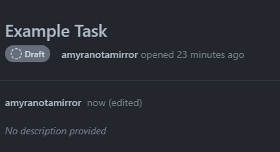
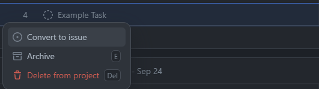
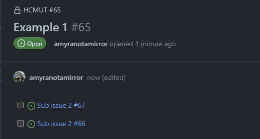
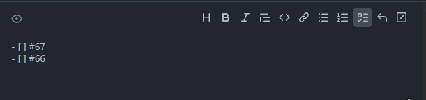
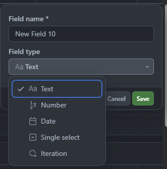

# Github Project

## Introduction
GitHub is a platform for software developers to collaborate and manage not just their code but the overall project planning and task-tracking process through a feature called “GitHub Project”. A project provides various views: spreadsheet, task board, or roadmap integrated with your issues and pull requests, which help your management process always stay up-to-date with the developing process.
## Setting up projects
1. We can navigate to the **“Projects”** tab from the header.

2. Create your first project by clicking on the **“New project”** button.
3. You can either “Start from scratch” or use the provided “Project template” (highly recommended) to get a grasp of this feature.

4. Play around with different types of views that your team would be more comfortable with.

## Creating and managing tasklist
### Getting familiar with issues
1. A task **before converting into issues** is just a draft task that doesn’t belong to any repository. 

2. **After converting them into issues**, we would be able to assign tasks to team members and relate them to pull requests and that issue will reside inside a repository. 

3. Each issue has an ID. If you mention an issue in the description section of another issue, it then can be understood as a subtask.

4. Use the checklist symbol before mentioning an issue ID so that it can display similar to the above.

### Add detailed information to your tasks
GitHub provides various data types to add more information to your task:
- A date field to track target ship dates.
- A number field to track the complexity of a task.
- A single select field to track whether a task is a Low, Medium, or High priority.
- A text field to add a quick note.
- An iteration field to plan work week-by-week, including support for breaks.

**After converting into issues**, you can also add repository information into your task:
- A member of your team to handle the task
- A milestone of your project
- A pull request

**Manage issue via GLI:**
- Installation: [GitHub CLI](https://cli.github.com/)
- Command guideline: https://cli.github.com/manual/gh_issue
> **Limitation:** GitHub free plan would limit some features if you make your repository private, some might be:
> - Can only assign 1 member to an issue
> - Can't track both private and public repository in 1 project